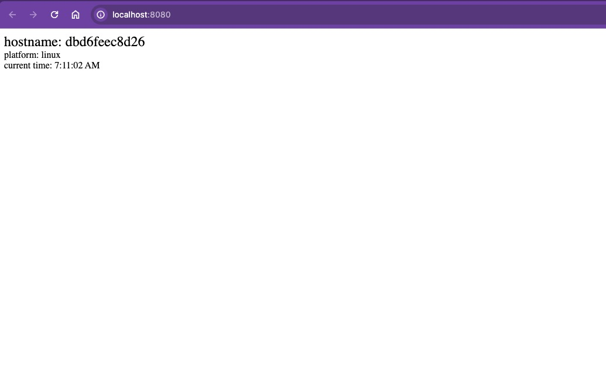

# Create Load Balancer with Nginx

 

type of nginx 

Round Robin:

 


Weighted Round Robin:

 


## create directory

   
    mkdir LAB1_Week10
    cd    LAB1_Week10
    

## git clone branch dev
    
    
   ```
    git clone -b dev https://github.com/Tuchsanai/DevTools.git
   ```
   
   ```   
    cd DevTools/02_Docker/Week10/01_LAB1_Nginx_LoadBalance
   ```


### Step 1: Building Docker Images for Express Apps


```bash

docker build -t express-app .

```

### Step 2: Creating a Docker Network

Create a custom network for your Docker containers. This allows the containers to communicate with each other.

```bash
docker network create express-network
```

### Step 3: Running Express App Containers

Run the containers for `app1` and `app2` on the created network:

```bash
docker run -d --name app1 --network express-network -p 3001:3000 express-app
docker run -d --name app2 --network express-network -p 3002:3000 express-app
```

display docker ps

```
docker ps -a
```

### Step 4: Setting Up Nginx for Load Balancing

this is nginx.conf file.

```
events {}

http {
    upstream backend {
        server app1:3000;
        server app2:3000;
    }

    server {
        listen 8080;

        location / {
            proxy_pass http://backend;
        }
    }
}
```

```bash
docker run -d --name nginx-load-balancer --network express-network -p 8080:8080 -v ./nginx.conf:/etc/nginx/nginx.conf:ro nginx
```

display Is nginx-load-balancer running?

```
docker ps -a
```


### 5. Testing Load Balancing:

Open your browser and go to http://ExternalIP:8080. You should see responses from your Express containers, rotating with each refresh.

| From Loadbalance No1 | From Loadbalance No2 |
|-----------|-----------|
|  |  |


# Clearing Up

```bash
docker stop $(docker ps -a -q)  
docker rm $(docker ps -a -q) 
docker rmi $(docker images -q) 
docker volume rm $(docker volume ls -q)  
docker network prune -f
```