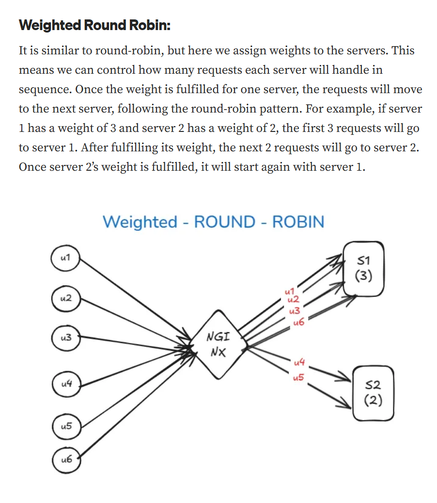

# 🚀 Load Balancer with Nginx + Docker

This lab shows how to use **Nginx** as a **load balancer** for multiple **Express.js containers**.

Think of a load balancer like a **traffic police officer at an intersection** 🚦. When cars (requests) come in, the officer decides **which road (server)** each car should go to. This helps prevent one road from being too crowded.

We will learn 2 main strategies:

* **🔄 Round Robin** → Requests are passed one by one to each server in order.
* **⚖️ Weighted Round Robin** → Some servers get more requests than others (based on assigned weight).

---

## 📌 Load Balancing Concepts

### 🔄 Round Robin

**How it works:**
Imagine you have 3 cashiers in a supermarket. Each new customer is sent to the next cashier in line. This ensures everyone gets work evenly.


**nginx.conf example:**

```nginx
events {}

http {
  upstream food-app {
    server food-server1:5000;
    server food-server2:3000;  
    server food-server3:8000;  
  }

  server {
    listen 80;

    location / {
      proxy_pass http://food-app;
    }
  }
}
```

➡️ In this setup, Nginx will forward requests **one by one**:
First to `food-server1`, then `food-server2`, then `food-server3`, and repeat.

---

### ⚖️ Weighted Round Robin (3:2)

**How it works:**
Now imagine one cashier works faster than the others. You want that cashier to handle **more customers**.

That’s what weights do. If cashier A has weight **3** and cashier B has weight **2**, cashier A will get 3 customers for every 2 customers that go to cashier B.



**nginx.conf example:**

```nginx
# Example weight 3:2
events {}

http {
  upstream food-app {
    server food-server1:5000 weight=3;
    server food-server2:3000 weight=2;  
  }

  server {
    listen 80;

    location / {
      proxy_pass http://food-app;
    }
  }
}
```

➡️ This means:

* `food-server1` gets **3 requests**
* `food-server2` gets **2 requests**
* Then the cycle repeats.

---

## 🧪 LAB A: Round Robin

We will build and run 2 Express servers, then use Nginx to balance requests between them.

---

### 1️⃣ Create a Project Folder

```bash
mkdir LAB1_Week10
cd LAB1_Week10
```

👉 Why?
We create a clean workspace to avoid mixing files with other projects.

---

### 2️⃣ Clone the Repository

```bash
git clone -b dev https://github.com/Tuchsanai/DevTools.git
cd DevTools/02_Docker/Week10/01_LAB1_Nginx_LoadBalance
```

👉 Why?
This repo already has a simple Express app that returns a message.
We’ll run multiple copies of it.

---

### 3️⃣ Build the Express App Image

```bash
docker build -t express-app .
```

👉 Why?
This creates a Docker image called **express-app** from the code inside the repo.
Think of it as a **template** you can use to create many containers.

---

### 4️⃣ Create a Docker Network

```bash
docker network create express-network
```

👉 Why?
Containers need a **shared network** so Nginx can talk to the Express apps by name (`app1`, `app2`).

---

### 5️⃣ Run Two Express Containers

```bash
docker run -d --name app1 --network express-network -p 3001:3000 express-app
docker run -d --name app2 --network express-network -p 3002:3000 express-app
```

👉 Why?
We now have 2 running apps (`app1` and `app2`). Each one responds differently (so we can tell them apart).

Check containers:

```bash
docker ps -a
```

---

### 6️⃣ Configure & Run Nginx Load Balancer

Create `nginx.conf`:

```nginx
events {}

http {
    upstream backend {
        server app1:3000;
        server app2:3000;
    }

    server {
        listen 8080;

        location / {
            proxy_pass http://backend;
        }
    }
}
```

👉 Explanation:

* **upstream backend** → Defines the group of servers (`app1` and `app2`).
* **listen 8080** → Nginx listens on port 8080.
* **proxy\_pass** → Forwards requests to `backend`.

Run Nginx container:

```bash
docker run -d --name nginx-load-balancer \
  --network express-network \
  -p 8080:8080 \
  -v ./nginx.conf:/etc/nginx/nginx.conf:ro \
  nginx
```

Check container:

```bash
docker ps -a
```

---

### 7️⃣ Test Load Balancing

Open in browser:

```
http://ExternalIP:8080
```

Refresh the page multiple times. You should see responses switching between `app1` and `app2`.

| From App1      | From App2      |
| -------------- | -------------- |
|  |  |

---

## 🧪 LAB B: Weighted Round Robin

👉 Try modifying `nginx.conf` so that one app receives **more traffic** than the other.


---

## 🧹 Cleanup

When you’re done, stop and remove everything:

```bash
docker stop $(docker ps -a -q)  
docker rm $(docker ps -a -q) 
docker rmi $(docker images -q) 
docker volume rm $(docker volume ls -q)  
docker network prune -f
```

