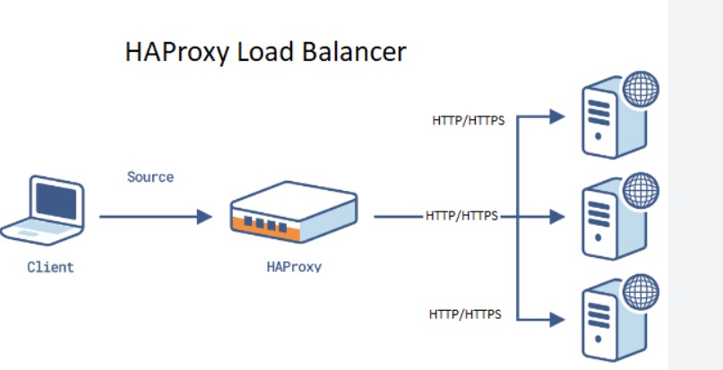
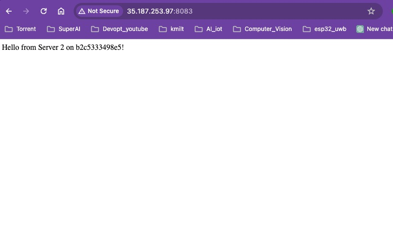
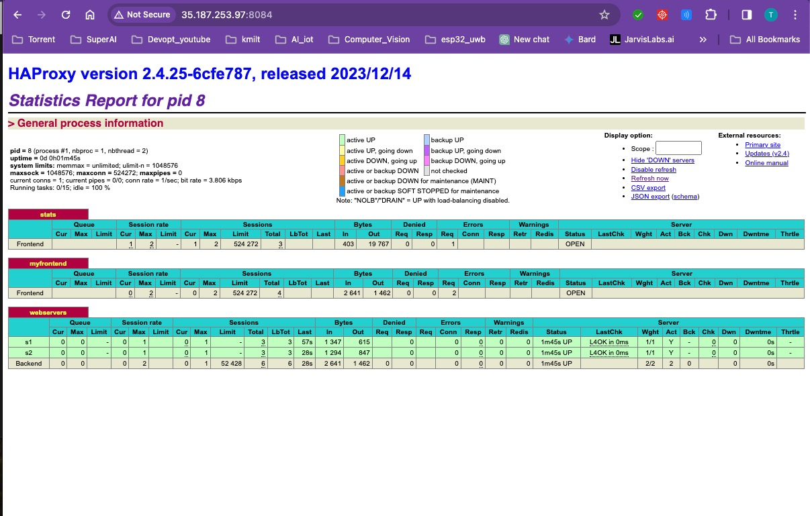

# load balancer with HAProxy

####  ref = https://www.haproxy.com/blog/how-to-run-haproxy-with-docker




## create directory

   
    mkdir LAB2_Week10
    cd    LAB2_Week10
    

## git clone branch dev
    
    
   ```
    git clone -b dev https://github.com/Tuchsanai/DevTools.git
    cd DevTools/02_Docker/Week10/02_HAProxy_Loadbalance/
   ```
   
   
  display the files
  
  ```
    ls -a
  ``` 

### 0. Create a custom network for your Docker containers. This allows the containers to communicate with each other.

```bash
docker network create express-network
```


## 1. Create express-app Docker Image

go to Express_Server directory

```bash
 cd  ./Express_Server
``` 

```bash
docker build -t my-express-app   . 
```


## 2. Run the Express Containers


- Run the first container:

```bash
docker run -d -p 8080:3000 --network express-network -e NAME='Server 1' --name express-server-1 my-express-app
```
- Run the second container:

```bash
docker run -d -p 8081:3000 --network express-network -e NAME='Server 2' --name express-server-2 my-express-app
```

display all the containers

```
docker ps -a
```

## 3. Create the HAProxy Docker Image

go to HAProxy directory

```bash
cd ~
```

```bash
cd   LAB2_Week10/DevTools/02_Docker/Week10/02_HAProxy_Loadbalance/HAProxy/
```

- Run the HAProxy Container


```bash
docker run  -d  --rm\
  --name haproxy \
  --network express-network  \
  -v $(pwd)/haproxy.cfg:/usr/local/etc/haproxy/haproxy.cfg:ro \
  -p 8083:8083 \
  -p 8084:8084 \
  haproxytech/haproxy-alpine:2.4

```

display all the containers

```
docker ps -a
```


### 5. Testing Load Balancing:

   

Open your browser and go to http://ExternalIP:8083. You should see responses from your Express containers, rotating with each refresh.

| Loab balance 1 | Loab balance 12|
|----------|----------|
|          |          |


### 6. Testing Statistic Page:

- Open your browser and go to http://ExternalIP:8084. You should see responses from your Express containers, rotating with each refresh.
- Open your browser and go to http://ExternalIP:8083/haproxy?stats




Important Notes:

HAProxy health checks (check in the config) are recommended for production.
Consider network configuration or using an internal Docker network if running on a remote server.


### Delete all containers

```
docker stop $(docker ps -a -q)  
docker rm $(docker ps -a -q) 
docker rmi $(docker images -q) 
docker volume rm $(docker volume ls -q)  
docker network prune -f
```

---
### Danger Zone for admin only : 

```
git checkout main
git branch -D dev
git push origin --delete dev
```
  
```
git branch dev
git switch dev
find "./" -type f \( -name "*.pdf" -o -name "*.jpg" \) -delete
git add .
git commit -m "delete files"
git push origin dev
git checkout main
```

