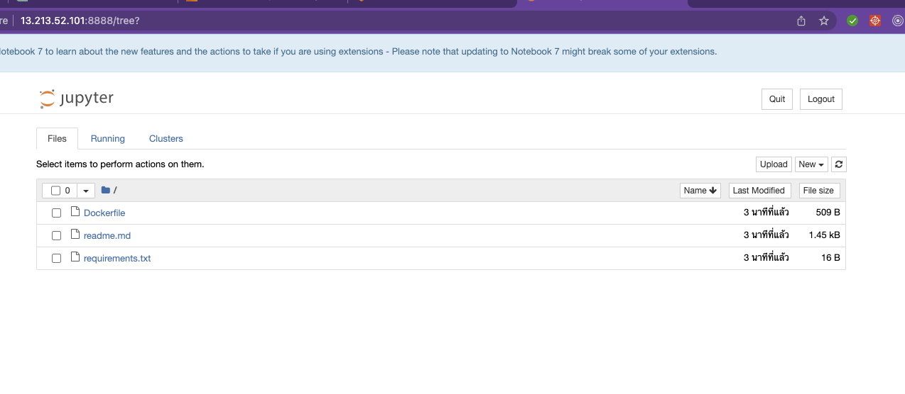

# LAB Basic example of a Dockerfile for creating a lab environment with Python, Jupyter, and some essential data science libraries:


### A Dockerfile is a script that contains instructions to build a Docker image. Here's a basic example of a Dockerfile for creating a lab environment with Python, Jupyter, and some essential data science libraries:




## create directory

   
    mkdir LAB1_Week11
    cd    LAB1_Week11
    

## git clone branch dev
    
    
   ```
    git clone -b dev https://github.com/Tuchsanai/DevTools.git
   ```
   
   ```   
    cd DevTools/02_Docker/Week11/01_Lab_Dockerfile/
   ```

## Watch for Dockerfile  in directory

```
cat Dockerfile

```


### Step 2:

###  To build the Docker image, save the Dockerfile and the requirements.txt file in the same directory, navigate to that directory in the terminal, and run:

```
docker build -t my_lab01 .

```

### Step 3:

###  After the image has been built, you can run a Docker container using the following command:

```
docker run -it --rm -p 8081:8888 -v $(pwd):/app my_lab01


```


--
### Danger Zone for admin only : 

```
git checkout main
git branch -D dev
git push origin --delete dev
```
  
```
git branch dev
git switch dev
find "./" -type f \( -name "*.pdf" -o -name "*.jpg" \) -delete
git add .
git commit -m "delete files"
git push origin dev
git checkout main
```
